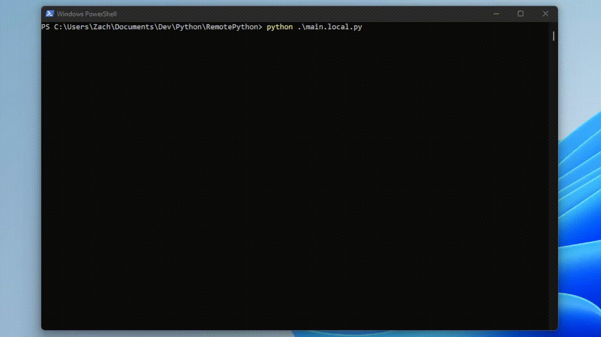

<h1 align="center">
  <br>
  
  <br>
  Remote Python
  <br>
</h1>

<h4 align="center">A remote code execution solution for python scripts.</h4>

<p align="center">
  <a href="#key-features">Key Features</a> •
  <a href="#demo">Demo</a> •
  <a href="#how-to-set-up-remote-python-server">Set up server</a> •
  <a href="#run-any-python-script-with-no-external-requirements">Run python script remotely</a> •
  <a href="#upcoming-features">Upcoming Features</a> •
  <a href="#license">License</a>
</p>

## Problems with local script execution

Computer can be too slow to run complex python scripts

Laptop can overheat

Slow execution

## Solution

Remote python execution

## Key Features

* Remote Code Execution

## Technologies Used
* tmux
* ssh
* scp
* python packages
  * paramiko

## Demo


### The following code is in main.local.py
```python
# main.local.py
from time import sleep
import platform

while True:
    print("Running on", platform.system())
    sleep(10)
```

### The following code is in main.remote.py
```python
# main.remote.py
try:
    from RemotePython import RemotePython
    RemotePython.run()
except ImportError:
    pass

from time import sleep
import platform

while True:
    print("Running on", platform.system())
    sleep(10)
```




## How to set up remote python server

In order to run remote scripts on your server you will need [OpenSSH-server](https://ubuntu.com/server/docs/service-openssh) installed in addition to [Python](https://www.python.org/downloads/) and [pip](https://www.python.org/).

```bash
$ sudo apt install openssh-server
$ sudo apt install python3
$ sudo apt install python3-pip
$ sudo apt install tmux

or

$ sudo apt install openssh-server python3 python3-pip tmux -y
```

That's it... your server is set up to run python scripts!


## Run any Python script with no external requirements

To add to Python scrips with no external requirements, you'll need [Python](https://www.python.org/downloads/) installed on your computer. And the following environment variables set...

```python
PYTHON_SERVER_IP        # The ip of the remote server you wish to run your script on.
PYTHON_SERVER_USER      # The username that you use to remotely connect to the server.
PYTHON_SERVER_PASS      # The password that you use to remotely connect to the server.
```


Add the following to the top of the python script you wish to run remotely:
```python
try:
    from RemotePython import RemotePython
    RemotePython.run()
except ImportError:
    pass
    
# The rest of the script you wish to run remotely below
```

## Run any Python script with external requirements

To add to Python scrips with external requirements, you'll need [Python](https://www.python.org/downloads/) installed on your computer. And the following environment variables set...

```python
PYTHON_SERVER_IP        # The ip of the remote server you wish to run your script on.
PYTHON_SERVER_USER      # The username that you use to remotely connect to the server.
PYTHON_SERVER_PASS      # The password that you use to remotely connect to the server.
```


Add the following to the top of the python script you wish to run remotely:
```python
try:
    from RemotePython import RemotePython
    RemotePython.run(path_to_requirements="requirements.txt")
except ImportError:
    pass
    
# The rest of the script you wish to run remotely below
```

## Upcoming Features
- Add ability to run scripts with external requirements

- Add gui
  - List running scrips
  - Upload script
  - Run an uploaded script
  - Stop an uploaded script
  - Delete an uploaded script


## License

MIT

---
> [zlincoln.dev](https://www.zlincoln.dev) &nbsp;&middot;&nbsp;
> GitHub [@ZacharyLincoln](https://github.com/ZacharyLincoln)

